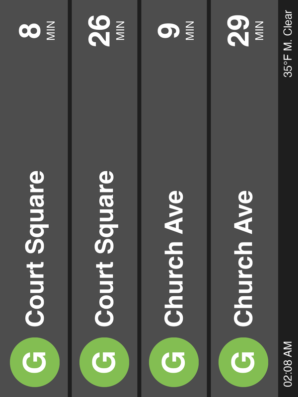

# WARNING: VIBECODED WITH CLAUDE


# Greenpoint Transit Tools

Real-time NYC G Train and Ferry information tools for Greenpoint, Brooklyn.

This repository contains two separate projects:

## 1. SwiftBar Plugin (`swiftbar/`)

**Real-time transit tracker for your macOS menu bar**

Shows G train and NYC Ferry arrivals in your menu bar using SwiftBar.

**Features:**
- Live G train arrivals (Queens-bound & Church Ave-bound)
- NYC Ferry arrivals at Greenpoint
- Updates every 30 seconds
- Click to see detailed arrivals

[→ Setup instructions](swiftbar/README.md)

## 2. MTA Display Generator (`mta-display/`)

**PNG image generator for digital displays**



Creates an 800x600 image showing G train arrivals and weather.

**Features:**
- 4 G train arrivals with real-time data
- Current weather from National Weather Service with icons
- Sunrise/sunset times with icons (shows upcoming time)
- MTA-style design with antialiased graphics
- Landscape or portrait orientation

[→ Setup instructions](mta-display/README.md)

## Quick Start

### Install Dependencies

Using uv (recommended):
```bash
uv sync
```

### Run SwiftBar Plugin

1. Install SwiftBar: https://swiftbar.app
2. Set plugin folder to `swiftbar/`
3. Plugin will auto-load

### Generate MTA Display

```bash
cd mta-display
uv run mta_display.py
# Creates schedule.png

# For portrait mode:
uv run mta_display.py --rotate
```

## Requirements

- Python 3.7+
- macOS (for SwiftBar plugin)
- Internet connection (for real-time data)

### Python Dependencies

- `nyct-gtfs` - MTA G train real-time data
- `gtfs-realtime-bindings` - NYC Ferry data
- `Pillow` - Image generation (for display generator)
- `requests` - Weather API calls (for display generator)
- `python-dateutil` - Date parsing for sunrise/sunset
- `pytz` - Timezone handling

Install all with uv:
```bash
uv sync
```

## Project Structure

```
ferryschedule/
├── swiftbar/              # SwiftBar menu bar plugin
│   ├── greenpoint-transit.30s.py
│   ├── get_ferry.py
│   └── README.md
├── mta-display/           # PNG display generator
│   ├── mta_display.py
│   └── README.md
├── dev/                   # Development & debugging scripts
│   ├── README.md
│   ├── debug_transit.py
│   ├── debug_ferry.py
│   ├── analyze_ferry.py
│   └── (more scripts...)
├── requirements.txt       # Python dependencies
└── README.md             # This file
```

## Data Sources

- **MTA G Train**: [MTA GTFS-Realtime Feed](https://api-endpoint.mta.info/Dataservice/mtagtfsfeeds/nyct%2Fgtfs-g)
- **NYC Ferry**: [NYC Ferry GTFS-RT](http://nycferry.connexionz.net/rtt/public/utility/gtfsrealtime.aspx/tripupdate)
- **Weather**: [National Weather Service API](https://www.weather.gov/documentation/services-web-api)

## Contributing

Contributions welcome! Feel free to:
- Improve ferry direction detection
- Add more transit routes
- Enhance UI/UX
- Fix bugs

## License

Free to use and modify
