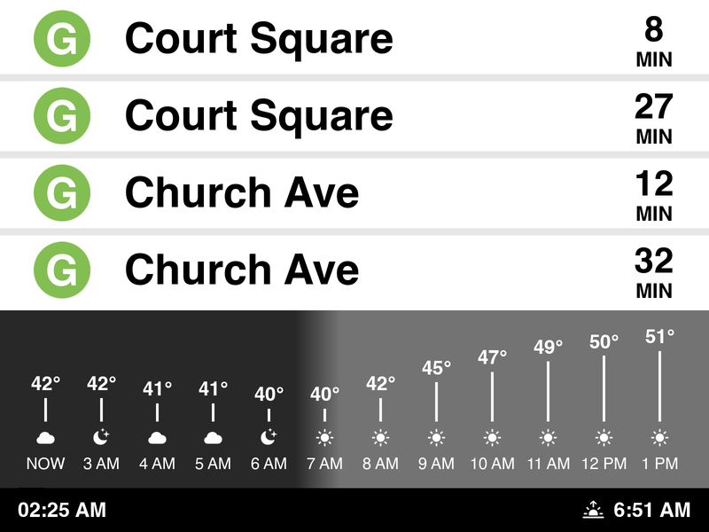

# Warning: VIBECODED

# MTA Train Display Generator

Creates an 800x600 PNG image showing real-time subway train arrivals with current weather. Meant to be used with [kindle-dash](https://github.com/pascalw/kindle-dash) and a jailbroken Kindle.

(Station is hardcoded)



## Installation

From the project root directory, using uv:

```bash
uv sync
```

Required dependencies:
- `Pillow` - Image generation
- `nyct-gtfs` - Real-time G train data
- `requests` - Weather API calls
- `python-dateutil` - Date parsing for sunrise/sunset
- `pytz` - Timezone handling

### Font Requirements

The project includes Helvetica TTF fonts in the `fonts/` directory for true MTA-style rendering.

**On Linux** (if fonts are missing), you can install fallback system fonts:
```bash
sudo apt-get install fonts-dejavu fonts-liberation
```

## Usage

### Basic Usage

Generate a landscape display (800x600):

```bash
uv run mta_display.py
```

### Portrait Mode

Rotate 90° counter-clockwise for portrait display (600x800):

```bash
uv run mta_display.py --rotate
# or
uv run mta_display.py -r
```

## Output

The script generates `schedule.png` in the current directory.

## Customization

Edit `mta_display.py` to customize:

- **Colors** - Change `BG_COLOR`, `LINE_COLOR`, `SEPARATOR_COLOR`
- **Dimensions** - Modify `WIDTH` and `HEIGHT`
- **Number of trains** - Adjust `limit` parameter in `get_all_trains()`
- **Location** - Update coordinates in `get_weather()` for different location

